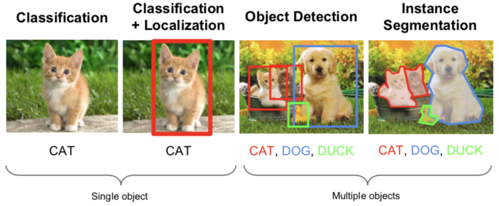
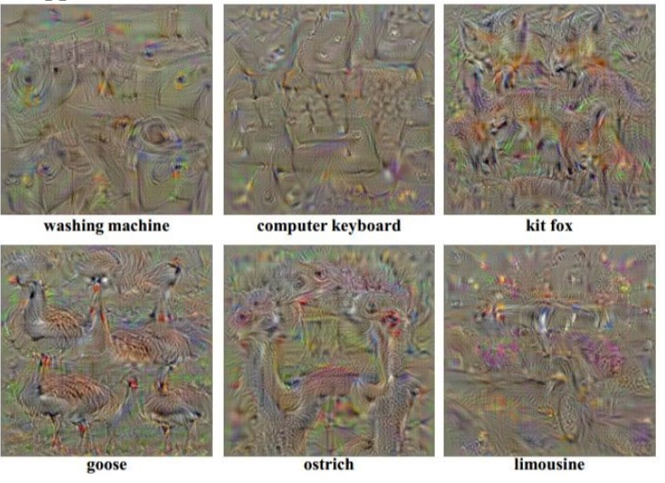

# Introduction
***
# Image Classification pipeline
## challenges 
* 图片是由无数数字块组成的
* 视角的转变，亮度的变化，变形都会产生非常大的变化
	* viewpoint
	* illumination
	* deformation
	* occlusion
	* background clutter
	* intraclass variation

## image classifer
* input:image
* output: class_label

## data-driven approach
* 其他方法不行
	* attempts: 边缘检测，纹理等等（但是太过具体）
* 以数据为导向的方法
	* def train(image, label)
	* def predict(model, test_image)

## KNN
### NN
* 对于每一个测试的data，在数据库里面找到离他最近的图片（选择一共找多少张，这么多张里面投票）
* 定义距离（hyperparameter）
	* 曼哈顿距离 L1: 两张图相减求绝对值，然后把整张照片求和
	* 欧几里得距离 L2: 距离的平方和开方
* 实现
	* training：记住每个图片的内容和label
		* image：N✖D，每行是一张图片（拉成一行），一共N张
		* label：1-d数组，sizeN
	* predict：计算距离找到最小的角标（np.argmin)
* 速度：linearly to size of dataset
* 缺点：
	* 预测的时间太长了（expensive）
	* 但是我们希望训练的时间长但是测试的时间短（CNN）

### KNN
* 找到最近的K个，投票
	* 当K增加的时候，整个图片的边缘变得平滑了
	* K的数量也是一个hyperparameter
* 需要选择的hyper（并不能很好的找到最优解）
	* K
	* 用什么distance
	* 如何选择最好的参数
		* 总不能尝试所有的参数吧2333
		* 不能使用test data，请在训练的时候忘记自己拥有它
		* 把train data fold成不同的部分，把其中的一部分当成测试数据（validation data），然后测试训练的结果寻找hyper
		* 交叉验证（cross-validation），循环当validation fold然后average result

### 但是根本不用呢
* 在test time的performance太差了
* 两个图片之间的距离太不直观了，你根本不知道图片间的距离会怎么变

## linear classification
### parametric approach
* 输入：32x32x3的图片，array of numbers 0,1,...3072
* f(x,W) = Wx + b （**在线性分类的情况下**） （10x1）
	* x: image （3072x1 -> 拉直了）
	* W: parameters，weights （10x3027）
	* b： bias （10x1），不是这个函数的参数，只是用来决定比如猫的数量特别多，偏向猫的bias可能就比较大
* 输出：10个数字，表示每个class的scores

### 注意
* W是把不同分类的classifer拼在了一起（乐高一样），每一行都是一个不同的class的分类器，点乘这个图片上面的像素，加上bias就是这个图片最终的得分
* resize所有的图片到一个大小（目前）
* 实际上每个class的score就是图片里面每个点的加权求和，可以想象成在数每个不同地方的点的颜色。如果把W矩阵还原，还原出来的就是这个class的感觉上的颜色
* 可以想象在一个巨高d的space里面，用线性分类

### hard part
* 都用灰度图会有问题
* 相似的texture（？

***
# loss function optimization
todo：
* 定义一个loss function来定义这个score的好坏
* 找到一个efficiently way去找到minimize 这个loss

## SVM loss
### 定义
* 假设如果只有三个种类，一张图片对三个class分别会有不同的score。每张图片都可以计算出一个对应的loss
* SVM loss Li = sum max（0，sj - si + 1）
	* si: 想要计算这个的loss function 的class的评分（也就是label标注的class的评分）
	* sj: 这张图对于所有其他种类（除了i）的评分
	* Li: 最终这张图片的loss
	* 1: 是一个safety margin（也是一个hyper parameter）。可以选择其他正数，但是选0会出问题
	* Li的每一项都在0和差值之间找最大值，然后把每一项的加起来求和
* 如何理解这个式子：既然对于不同class的评分越高就是越可能，那么评分是负数的话就说明不可能，这样就直接用0把这种可能性抹去了。如果其他种类在正的方面评分越高，说明这个种类跑偏了，loss越大


###注意点
* 在上面这张图里，因为车的评分已经是最高了，计算出来的loss就是0
* 最后再把所有类型的loss求和，除以种类得到最终的loss
* 用的是求和而不是mean也是取决于自己的决定
* 也有的SVM里面用的是max之后平方，但是不平方的用的更多一点，也是一个hyper parameter
* scale
	* 最小：0
	* 最大：infinite 


### bug
* 在实际应用里面没有那么好的效果
* W不是唯一的，比如把这个W加倍，如果loss是0的时候是一样的 -> 需要得到唯一的W

### weight regularization（解决上面这个问题）
* 在之前的loss的基础上加上了 \lambda R(W)
	* \lambda是一个hyper parameter，是取决于自己的选择的
	* R是一个regularization函数，这个函数的作用是抵抗之前的loss。因为之前的loss是从训练集上得到的，比较吻合训练集，所以需要一个比较特别的W来和之前的fight，这样的话结果可能会在实际使用的时候更好一些
* 主要分类
	* L2 regularization：W里面的所有项平方然后求和（最常见）
	* L1 regularization：W里面所有项绝对值然后求和 -> 在一些其他地方使用
	* elastic net（L1+L2）：所有项平方乘参数加绝对值求和
	* max norm regularization -> 后面讲
	* dropout
* 理解L2
	* 比如X是[1,1,1,1],两个W分别是[1,0,0,0]和[0.25,0.25,0.25,0.25]
	* 这样乘出来的最终结果都是一样的，都是1。
	* 但是如果加上了L2的regularization之后就发现第二种方法的loss更少一点。因为他用到了更多的维数，在实际应用之中效果更好。

## softmax（用起来更好）（multinomial logistic regression）
### 定义
* scores：unnormalized log probabilities of the class 
	* 需要把score先exp回来(这样所有的数都变成正数了)
	* 再normalize（除以所有exp之后的的和）
	* 最终，对于正确class的最终处理完的score来说，max这个log或者min（loss function）- log会得到最终最好的结果
* 最终处理完的score就是每个类型推测出来的占比可能性（和为1）
* 这里求完-log（p）其实就是信息熵，代表对不确定度的度量
	* 直接比较可能性和log之后比较可能性在本质上是没有区别的
	* 但是数学上一般log之后的数据会看起来好一些

实际操作如下


### 一些问题
* 极值
	* Li最小值：0 -> 如果正确类型的可能性是1，求出来的最终值就是0
	* Li最大值：infinite，可能性非常低非常接近于0
* 当W的初始化很小，所有score都接近于0：
	* score求exp之后都是1，normalize之后是1/num（class），最后再求log
	* 可以用于开头的检验
* SVM和softmax
	* 如果输入是[10,-100,-100]，在这个范围里微小变化，第一个是正确的class
	* 对于SVM来说，后面两个负值都非常小了，根本不会去管后面的两个东西，-100和-200没啥区别
	* 对于softmax来说，后面的-100还是-200还是会对loss最终的值产生影响，softmax希望所有的值都在正确的class上面，后面啥都没有。所以更具有robustness。
* SVM会有一个你需要的区域，剩下的根本不考虑；而softmax会考虑所有的区域

## 上方区域总结

* x：训练集里面的数据，放在图片里就是把一个图片拉成一个1xN的向量
* y：训练集的标签，用来和最终的结果比对
* W: weights，需要优化的部分
* L：loss，用来权衡W优化结果的好坏
* 基本过程
	* Wx+b得到目前的分类器的score（score function）
	* y是目前分类应该有的结果（label）
	* R（W）得到regularzation的值
	* 分类器得到score，y知道正确的分类，通过softmax或者SVM得到这个分类器目前的loss，再加上R（W）的部分增加robustness最终得到整个分类器的loss

## optimization loss
### follow the slope
* 通过计算gradient来找到最低点
* 最基础的想法：（从数学上入手）
	* 因为梯度是lim f(x+,h)-f(x)/h
	* 把W上面的每一个点都加上一个0.00001（接近于0）然后再求上面的式子，就能得到第一次操作的梯度
	* silly
		* 每一步都需要每一个维度都算一下，在CNN里面参数高达百万个，计算太慢了
		* 因为用的0.00001，其实并不准确
* 感谢牛顿莱布尼兹发明了微积分 -> 如何具体计算在下一节课
	* 把loss的gradient改成了一个式子
	* 快速，准确，然是容易发生bug（error-prone）
* **practice**需要进行gradient check
	* 在写代码的时候用的肯定都是analytic gradient
	* 但是需要在应用之前用numerical gradient检查一下，确保两者的结果是一样的，为了保证代码里面写的积分是正确的

### gradient descent

* mini-batch
	* 在实际应用的时候，不会把整个的训练集都拿来优化W，而是会把一部分拿出来（sample examples）
	* 一小点一小点的拿结果不会非常准确，但是可以step很多次，在实际应用里面一般都不会用整个training set，不是很现实而且效果不是很好。
	* 选择的数量上 32/64/256，这个不是一个很重要的hyperparameter，主要是根据GPU的性能来决定的
	* 最终结果的loss是会下降的，虽然noise很多但是最终会go dowm
* learning rate


## 图片中使用linear classifier
因为图片像素太多了，不可能对每个像素都用线性分类，所以一般会先提取一些特征然后得到最终的分类结果
### color histogram
* 先得到一张图片的颜色特征分布
* 然后把整个特征分布拽成一个长的vector进行分类

### HOG/SIFT
* 找到边缘特征，在图片的哪个部分有那种样子的edge

### bag of words
* 先把图片里面的一些特征当作一个vocabulary，然后放进一个词典里面
* 找到词典里每个词出现的频率然后拽成vector
* 线性分类

### 总结
一般都是先进行特征提取然后再进行线性分类 <-> 深度学习特征都是自己提取
***
# Backpropagation & neural network
目的：求出来loss function的gradient
## backpropagation

最右边的点因为是df/df所以结果就是1

* forward pass：知道开始然后一直顺到结束
	* 在一个node上面，收到了x和y的input，对他们进行f操作，得到最终的结果z
	* z再往后操作得到最后的loss（不知道什么操作）
* backward pass：从后到前，通过链式法则倒回来
	* 虽然不知道loss对x或者y的gradient，但是可以求出来dz/dx和dz/dy（只和这个点有关）
	* 可以得到dL/dz，然后乘以local gradient

* local gradient
	* 每一个node上面的gradient往前推的时候，都可以通过链式法则（chain rule）变成这个点输入的gradient和这个点到上一个点的gradient的乘积。
	* 算local的时候，乘的参数是输入进去的参数啊。比如dL/dx = dL/dz（这个带这个点back回来的数字） * dz/dx （这个里面的x带这个点输入进来x的值）
	* 想不明白的时候把不同的点假设成不同名字然后求导！
	* 在这个网络里面，如果gate是加法（x + y）的话不是求偏导，如果求x的导数的话y并不是参数而是常数，所以求出来的结果是1，所以加法的gate就是直接把这个值相等的分开
		* 加gate是一个gradient distributor，当一个gradient进来的时候会被相同的分开成了两份
	* 也可以把一些gate组成一个大的gate，比如sigmoid
* 注意，求出来的gradient如果是正的，说明这个点对最终的**loss**有positive的作用
* patterns
	* add：gradient distributor
	* max：router
		* 假设f是max（x，y）
		* local gradient对最大的那个就是1，对其他的都是0
		* 因为如果没能通过max的gate的话根本对后门的loss没有影响。back的时候走最大的点就可以了，其他的都不用管了
	* multiply：switcher，真，两极反转
* 当往回的时候，两个点指向一个点，gradient需要相加（如下图）


## Implementation
### psuedocode
* graph or net object
	* forward:
		* 把input pass进这个gate里面（必须在代码里面记住input）
		* 把整个computational的garph往前推动
		* 最后一个gate会return这个网络的loss
	* backward
		* 输入dz，然后乘不同的x和y
* 不同的gate分别是不同的文件（API），每个文件里面包括初始化，forward和backward
* 每次update的时候都需要进行forward和backward，forward得到gradient，backward再回来求最终的loss

### vectorized
* 在实际的计算中x，y，z都是矩阵，dz/dx是jacobian矩阵（全部都由偏导组成的矩阵）
* 比如一个max的门，如果输入是1x4096，输出也是1x4096，但是求偏导出来的矩阵是4096x4096（太大了），矩阵中间只有对角线部分的是需要考虑的（还会有很多0）
	* 然后如果用了minibatch的100，得到的结果就是409600了，更可怕了
	* 所以在每次API的时候，肯定不能写出来所有的链式法则，只用其中的一部分
	* **作业的重点就是如何让这个东西计算出来效率高**

## neural network
### 两层的NN

* 输入是图片一共的坐标数量
* 先通过第一层（max）得到100的中间层（hidden layer）-> 100是hyperparameter，自己定的，但是越多越好吧
* 然后通过W2得到最终的分类结果（分10类）
* 其实具体里面是什么东西真的是不知道的？


### 神经元
* 每个神经元的输入是Wx+b，然后经过激活函数 输出
* 激活函数 activation function
	* sigmoid
	* tanh
	* ReLU
* 层状 -> 可以更加efficient


# Neural network 2（training part1）
前方提示：
* 小的dataset也可以有结果
* 电脑的性能有限

## 回顾一下历史
* perceptron -> 激活函数：0或者1，不能back
* madaline
···

## activation function（一个hyerparameter）
### sigmoid

* 特点：
	* 把所有的数值都压到了0到1之间
	* 曾经非常受欢迎，因为satrating的效果比较好
* 问题：
	* 在saturate的情况下（非常接近0或者1），会杀死gradent -> 看函数的图就能感觉出来-10做哟的导数就是0了，back回来没有意义
	* output不是以0为中心的（预处理的时候希望是0中心的）
		* 不是0中心的问题：如果所有输入的x都是positive的话，得到的gradient要不都是positive要不都是negative
		* 最后走出来的路径都是zig zag的
	* exp（）在计算上比较expensive

### tanh
* 把数字从-1到1之间分布，是一个以0为中心的sigmoid（0-centered），所以sigmoid的缺点（saturated的点会kill gradient）的缺点还在

### ReLU

* 输入是正数的时候直接pass这个值，输入是负数的时候直接kill
* 可能的优点：（实际应用的时候效果非常好但是具体解释起来也没有那么知道为什么）
	* 不会saturate（不会消失gradient）
	* 计算效率高
	* 更容易相交
* 问题
	* 不是0-centered
	* 如果x小于0（没有激活） -> kill gradient）
	* 死的时候会死一大片 -> 所以一般的时候会把relu初始化的时候加上一个slightly positive bias
	* 注意learning rate，选不好容易死

### leaky ReLU

* 在小于0的时候会有一个微小的值，所以不会die
* 在使用的时候converges的速度比sigmoid和tanh快很多
* 加上了一个参数，可以在back的时候学到，这个值可以确定他是不是ReLU或者其他的

### Maxout neuron
* 把ReLU和leaky ReLU组合了起来，有两个参数。算出来两个分别的值然后取其中大的那个
* 不会发生saturate或者die的问题
* 问题在于参数需要计算两次

## 步骤： 预处理数据 -> 选择architecture
## data preprocessing
### ML
* 处理数据的时候首先需要0-center -> 减去平均值（不是特别需要normalize，ML需要）
* PCA，Whitening，其实都在DL里不怎么常用

### 实际应用里：只需要center
* 比如一张图是32x32x3的
* 减去mean image（32x32x3）
* 减去per-channel mean （每个channel的mean，一共是三个数字）

## weight initialization（重要）
请不要这么做：set所有w都是0，得到的结果就是每个神经元的功能都是一样的

### small random numbers
* 0.01* np.random.randn(D,H)
* 问题：
	* 在比较小的net里可以使用
	* 在layer之间会发生non-homogeneous distribution of activation的问题
		* 所有的activations会变成0
		* 在back的时候所有的gradient都会变成0
* 如果把0。01变成了1，这时候发现所有的neurons全都是1或者-1 -> gradient也全都是0，死亡

### 其他的一些论文也讨论过其他方法
* Xavier 2010
	* 除以input的sqrt
	* ReLU， non-liear，会breaking。每回relu都会杀掉一半的东西，set到0
* He 2015
	* 把input除以2以后sqrt了
	* 在实践中很有用


### batch normalization -> 实际中解决w初始化的方法
* 核心思想：x越来越接近0的原因是因为越乘越小（或者越大），这个时候我们就希望可以normalize这个x的input。因为gaussian的normaliztion是可以积分的，所以可以放回到back里面，在整个的网络里面插入一些normalize的部分就可以了
* 插在FC或者CNN之后，然后放在激活函数之前
* 优点
	* 提高net里面的gradient flow
	* 允许更高的学习率
	* 减少对初始化参数的影响
	* form of regularization -> 可能可以减少dropout的需求

## babysitting & learning process
### 检查loss算的对不对
* 初始化这个net，去掉regularization，检查最后返回的loss
* 因为什么都没做呢，所以loss应该是最终知道的值（10 class是2。3）
* 再加上regularization，结果应该小小的变化

### 尝试训练
* overfit一个非常小的dataset，关掉reg，得到非常小的loss和很高的accuracy
* 一个可能性：建议以一个小的reg开始，找到让loss变小的learning rate（如果不变小可能是rate太小了）
* cost：NaN，可能是learning rate高了
* 建议范围： 1e-3 ~ 1e-5

## hyper optimization
### 交叉验证
* 找到准确率高的部分，使用其中的hyper
* 最好set到log的space
* 再调整parameter，找到更准确的值
* 如果结果特别好可能也不对，可能是已经到了boundary了

### 参数的选择sample
* randomly的结果更好，不要固定一个选另一个，可能一个参数比另外一个重要很多
* 如果训练和验证之间的gap太大，说明overfitting，需要增加reg的力度。如果太小可能需要增加model的容量
*  ratio between the values and updates: ~ 0.0002 / 0.02 = 0.01 (about okay)

### 需要选择的hyper
* net architecture
* learning rate. decay schedule and update type
* regularization(L2/Dropout)

##总体summary


# training Neural Net2
## parameter update
### SGD
* 以前是直接用gradient来update，现在希望变得复杂一点 -> SGD太慢了
* 为什么SGD太慢：
	* 如果在一个loss的分布上，一个维度特别密集，另一个维度特别稀疏，直接用gradient改变就会在一个方向跑大了
	* 最后就会形成那种zag的形状

### momentum update
* 在计算的时候引入了速度v = mu * v - learning_rate * dx （v初始化为0）
* 假设路线就是一个球在loss的圆弧里面运动，mu是～0.5，0.9，0.99（只使用一个值，single number，hyper）
* 形态，从初始点开始走一个大的圆弧，会跑过了，但是会再快速的converge回去
* 优点
	* 引入了速度，可以在比较shallow的方向上速度逐渐增加
	* 在比较深的维度上面，就像球在圆弧里面来回滑动

### nesterov momentum update

* 在上面的方法之后 look a head 了一步，得到的是两个向量之间的差
* 在实际走的过程当中，弧度会比monnument的更大一些，跑过的会更小一些

### adaGrad （parameter-adaptive）
* 首先定义了一个cache，这个cache是gradient的平方的和，只是positive，和parameter的维度是一样的
* 然后把SGD的学习率scale了一个这个数
* “ Added element-wise scaling of the gradient based on the historical sum of squares in each dimension”
* 结果：在越密集的维度上，update的步伐越小，越稀疏的上面update越大
* 问题
	* step size：时间越长learning rate会最终变到0，然后就停止学习

### RMSProp（上面一个的变形）
* 把cache的定义改变了，增加了一个decay rate（hyper）
* 依然能保持各个维度上面的平衡，但是不会让learning rate变到0

### adam

* beta都是hyper
* 结合了上面的两种方法

### 实际使用
* 默认用adam
* 刚开始使用高的learning rate -> 这样进展会非常快
* decay over time -> 在进行到一定程度的时候会没有办法更细致的逼近minimum
	* step decay: 比如过一些epoch之后就把lr减少到一半
	* exponential decay
	* 1/t decay

### secend order optimization method（ml）
* 在计算的时候不仅需要gradient，还需要hessian来告诉你曲面的curve程度，以此来确定如何前进（牛顿method）
	* 速度更快，hyper更少
* 但是在deep nets里面不太能使用，因为参数太多惹
* BFGS（approximate inverse Hessian with rank 1 updates over time (O(n^2) each).
* L-BFGS
	* work well in full batch
	* mini-batch不是很适用

## evaluation：model ensembles
* 可以不用训练很多个model，而是训练一个然后在其中选取不一样的check point
* track一个参数vector的running average可能会得到更好的效果

## regularization（DROPOUT）
* 在forward的时候，随机的把一些neruon的值设置成0（比如杀掉一半）
* 为什么要使用：
	* 为了求出来的结果更加的准确，每个特定的特征都不能完全依赖，因为这个feature可能就被drop掉了
	* 计算一个大的net的其中一小部分，被drop掉的部分在back的时候也不会再计算了，就彻底关掉了。相当于在net里面取了一部分sample
* test time
	* 在测试的时候希望可以把所有的neuron都打开（就进行一次）
	* **scale！！！！**

* 需要注意的问题：
	* 计算训练时候的期望，就发现dropout之后的期望是测试的实际值的1/2（因为drop了一半）
	* 因为以前net没见过这么大的output，会直接死掉，所以需要把测试时候的结果再缩小一半（或者drop的比例，* p）
	* 最终结果：测试时候的输出 = 训练时候的期望输出
* 另一种方法 inverted dropout
	* 在train的时候 / p
	* 在测试的时候就不用改变了

## gradient checking（并没有讲）


# CNN开始啦
## 卷积层（核心部分）
* 对一张图片操作：
	* 拥有一张图像32x32x3
	* 拥有卷积核5x5x3（这两个东西必须维度一样） -> 奇数尺寸的效果更好
	* kernal做卷积（所有的channel），得到一个28x28x1的activaton map
	* 再对这张图片使用下一个不同的卷积核（卷积核的数量是一个hyper）
* 这样一个32x32x3变成了一个28x28x6（6是选择的hyper的数量）

* 当把这些层可视化了之后，发现越深图片的feature越高级（从上一级的特征得到的新的特征）

## 大致布局
* 卷积层
* RELU层 -> 黑白化
* pooling层
* 最后加上fc层

## 具体计算
### stride
* 每次卷积核移动的时候的步长
* 注意在不同图片大小，不同卷积核大小和不同步长可能不匹配
* （图片 - 卷积核）/步长 + 1     是不是整数，结果是输出图片的尺寸

### padding
* 可以在图片周围一圈加上一圈0，这样图片卷积之后的大小就不变了
* 0-padding的大小和卷积核的大小有关，大小是（卷积核 -1）/2
* 如果不进行padding，图片会越来越小

### 参数数量
* 对一个卷积核：卷积核的大小 * 深度 + 1 （加一是加了一个bias）
* 一层的参数： 卷积核数量 * 一个卷积核
* 四个hyper：
	* K：filter的数量，2的指数 -> 计算效率高
	* S：步长
	* F：卷积核大小
	* P：0-padding

### 1x1的卷积
* 1x1的卷积层（stride也是1）会有比较好的效果
* 比如输入是56x56x64，filter是32个1x1x64。因为数据是有深度的，1x1的时候是有意义的（在二维上面没有意义）

### 现在处理的东西都是方形的

### 从神经元的角度来看CNN
* 可以把filter认为成一个固定位置的神经元，这个神经元只看到了图片上面的一小部分，没有和全部的图片相连，然后进行了wx+b的运算
* 当slide这个filter的时候，weight是不变的，可以假设成一圈共享参数的神经元
* 对同一张图片的不同的filter可以认为成他们是在三维上面排列的一组神经元，每一层神经元都和这一层共享参数
（不希望全部都是全联接，因为浪费了很多参数）

## pooling
* 在卷积的时候是不会改变图片的大小的
* 改变图片大小的操作在pooling layer里面实现
* 长宽缩短，深度不变

### max pooling
* 2x2pool，stride2 -> 每4个格子里面选择一个最大的表示
* 两个参数
	* pooling size F 2，3
	* stride S 2，2
* 不会改变图片的深度

## fully connected
* 就跟普通的神经网络一样，所有神经元之间都会连接
* 把最后的图片变成一个列，放进去开始计算

## 实际应用
### LeNet-5
### AlexNet
* 两天不同的线，因为当时的GPU的效果不够
* 优点：
	* 第一次使用ReLU
	* 把data normalization了，但是现在看其实并不需要
	* data augumenation -> 有用！
	* dropout 0.5，最后几层

### ZFNet
* 在第一层上比alex的stride短，因为alex的步长4跳过了太多图片信息，这里改成了步长2
* fliter的数量更多

### VGGNet
* 只有3x3 s1 p1的卷积核，和2x2 s2的max pooling
* 结果还特别好
* 图像的尺寸越来越小，但是深度越来越高
* 需要的计算量：93MB/image（forward） -> 200m/image(所有的计算加起来)
* 大部分的memory都在前期的层里，大部分的参数都在最后的全链接层里面（最后的计算量太大，后面有更好的方法）
* VGG也有位置确定，他比overfeat的层数更深

### GoogLeNet
* 是一个一个的小结构组成出来了
* 参数的数量非常少 5million，取消了fc层
* 使用了average pool，把7x7x1024变成了1x1x1024	:把每个activate map取平均值
* 用VGG的人更多因为VGG的结构比较好想2333

### ResNet
* t5 error降到了3.多
* 平常的加深层数训练集和测试集上边的准确率变化结果不统一，但是res做到了统一
* 虽然层数特比多，但是速度还是快 -> 加入了skip的部分，把输入跳过了卷积又加了回去，这样back的时候就会分流


### top-5 error
* 在看结果的时候不光看准确率，还会看分类器认为的前5个可能性（可能有几千个分类），如果这5个可能性都不对的话就是求出来的就是top-5 error


# spatial localization and detection
这章的主要内容是识别出来这个东西之后用框框框出来


## 分类+定位：Localization as Regression
* 实际上就跟regression差不多
	* neurral net的输出是bounding box（4个数字），左上角的坐标和长宽
	* 实际的图片标注的内容也有左上角坐标和长宽，求出这两个部分的L2 distance作为loss

### 步骤
* 训练（下载）一个分类的model
* 在net里面加上fc的regression head
* 用SGD和L2loss训练regression head部分
* test的时候分类和regression都用

### 类别
* 平常的分类：最终的数量和class的数量相同
* 一个box里面会有4个数字，一共Cx4个数字 

### 加在什么地方
* conv layer之后
* fc之后

### 多个目标的检测（Aside）
* 知道准确的检测目标的数量k，那么最终的分类数量就是4 * k
* 应用：人的动作检测 -> 得到关节的位置


## 分类 + 定位：sliding window：overfeat
* 核心idea：在检测的时候直接process图片，但是对一张图片在不同的地方进行多次操作
* 操作步骤：
	* 首先对图片进行conv和pooling，然后对得到的结果进行两个不同的fc，
		* 得到的是1000个的分类种类
		* 另一个的到的是1000x4的bounding box坐标
	* 在一张大的图片上，在不同区域找到需要寻找的东西（比如分成四部分，这四部分是**有重叠的，不是pooling那个样子**）
	* 得到每个部分对于这个分类的得分，以及相应部分对应的bounding box
	* 最后用没怎么讲的办法merge了这些框，得到了最终结果
* 进一步优化
	* 因为要对这个图片的不同crop做cnn，计算量会非常大
	* 在fc层其实只是一个向量1x4096，把这个玩意拉成了一个cnn，4096x1x1，然后直接conv1x1的卷积核
	* 现在net里面就只有conv和pooling了，所以就可以处理不同尺寸的图片了（不同尺寸的方形）
	* 而且在处理不同区域的时候是参数是share的


## 目标检测
* 主要不同：不能确定图片里面物体的数量
* 思路：
	* 尝试所有可能的window然后用classifcation找到需要的部分
	* 问题：需要很多次分类
	* 历史解决方法：用非常快的分类器，尝试所有（linear classifier） 
	* 更想用的方法：用cnn，只测试tiny subsets of possible locations

### region proposals
* 输入一张图片，输出所有可能有物体的区域
	* 不在意到底是什么类型
	* 不在意精确度
	* 但是速度很快
* selective search
	* 从一个pixel开始，如果相邻的pixel有一样的颜色或者texture，merge
	* 形成连接区域，再连接不同区域，这个区域也可以再打散
* 还有很多其他方法：edge boxes（推荐）

### RCNN（region based CNN）
* 从输入图片里面用region proposal的方法得到一系列的boundings（不同的位置和scale）
* 对每个区域crrop和wrap这个区域到fixed size
* cnn分类，regression head & classifcation head
* 过程
	* 下载model
	* fine-tune for detection：改变分类的种类等
	* extract features
	* 为每个class训练一个SVM（看这个区域是否包括寻找的东西）
	* box regression：对每个种类，训练一个linear regression来纠正位置的偏差（太左太右，空隙太多）（dx，dy，dw，dh）
* datast
	* PASCAL VOC 比较小
	* ImageNet 不是事很好操作，但是一张图一半只有一个东西
	* MS-COCO 一张图多个内容

### fast RCNN （提速）
* 在测试时的速度比较慢 -> 一张图里，在不同的proposals之间share conv的计算
* 训练时不是一起训练的，训练的pipeline也很复杂 -> 把整个系统端对端对的训练一次
* ROI pooling
	* 在用的时候希望感兴趣区域的分辨率比较高，fc层希望更低的conv feature
	* 在conv feature map上面投影高分辨率的region proposal
	* 把这个区域分成小格，然后对每个格子进行max pooling(back的时候也是这么回来)
* 训练8倍！测试146倍！结果更准确！


### faster RCNN（再提速）
* 之前的测试速度计算都没有算region proposal的时间，所以把这个问题也交给conv去干
* 在最后一层conv后面加入region proposal net
	* 在feature map上面的移动实际就是卷积
	* 训练一个小的网络判断是不是一个物体并分类，以及regression框的位置
	* 在每个位置使用了N anchor boxes，不同的anchor有score来判断他是否属于一个object，在不同的形状上有不同的可能性（？
* 后续的paper里面可以一口气train了

### yolo
* 把detection变成了regression的问题
* 分成不同的小块，在每个块里面都加入


# visualization, deep dream, neural style
可视化：观察神经网络如何工作
## 可视化不同位置
* 可视化activation的神经元 -> 大量的图片扔进神经元里面，找出来一个神经元最感兴趣的部分
* 可视化fliter -> 只能在第一层进行（其他的层可以但是意义不大） 但是啥算法都会得出来长得差不多的
* 可视化特征（全联接层的特征向量） ->
	* t-SNE：Embed high-dimensional points so that locally, pairwise distances are conserved，特征相似的东西会聚类
	* 对图片进行遮罩，可以看出来遮住不同地方这张图片被识别出来的概率
* deep conv和optimazation的可视化工具：http://yosinski.com/deepvis

## deconv实现
### 问题1:如何计算任意一个神经元的梯度（代码实现）
* 找到想要的神经元，forward的时候就停在这里
* 然后进行back，把所有其他的神经元的都设置成0，只把感兴趣的神经元设置成1，然后计算back出来的结果
* 最后的结果看起来并不是很好理解，所以改变了back的方法，得到更好的结果（“guided back”）

* guided back的计算方法
	* 在普通的计算中，back的时候使用relu，会把所有负值都转化成0
	* 在guide的计算里，在激活之后的东西back回去的时候，如果input的东西是负数的话，也会把这个东西kill成0，也就是说一个是block back的时候的gradient的值，另一个还会附加block输入进来的值

* 发生了什么：把输入进去ReLU的负的影响也取消掉了。如果不取消的话，这些正负就会互相fight，呈现更奇怪的图片。但是去掉负的之后变得就更清晰了。
* deconv：直接无视掉relu的存在了

### 第二个问题：图像优化
* how to find an image maximize some class score，但是整个网络不变
	* 输入一张全0的图片
	* 在back的时候把score设置成[0,0,0,1,0,0,...]，只有感兴趣的是1
	* back回去，找到对图片会产生什么影响
	* 不停的重复这个步骤，更新的是图片不是weight

* 效果
	* 找到可以让一个类型分数最高的图片（图片是根据网络生成的）
	* 可视化data的梯度 -> 得到了一个类似热量图的东西，这样对黑色的部分改变对这个东西的分类没有很大的影响
* 上面的步骤可以对任何的神经元进行（生成一张图片）
* 更好的regular
	* 忽视了惩罚，只max神经元
	* 但是更新之后blur了一下图像，这样可以阻止图片进行高频率积累

### 第三个问题，CNN的code包含多少信息
* 是否可以通过net还原出来原来的图片（涉及到隐私泄露的问题）
* 越往后的时候预测的准确度越低

## deep dream
* 一个非常简单的过程，只有几百行代码，就是optimazation image
	* 每次调用make_step图片都会发生微小的改变
	* 把网络forward到一个位置
	* 把gradient设置成activation设置成一样的
	* 再往回传回去
* 可以强调对图片贡献最多的部分，不管激活了什么，都会把这个激活加强

## deepart
* 把目标的content传进CNN
* 把style contet也传进CNN
* 把目标的loss和style的loss匹配，然后得到相应的opt image

## 是否可以用生成的图片去fool CNN
* 把图片的gradient设置成其他的东西，本来希望可以得到混合的结果，但是实际上图片的distort根本看起来不变
* 有些图片人类看起来差不多，但是gradient（或者HOG）之类的可能彻底是其他的东西
* 原因：
	* 图片有很高维度的空间
	* 实际训练的图像有一小部分被约束，放了一个线性分类之类只调整了其中的一小部分
* 在线性分类里，如果在每个维度上面都改变了一点点，实际上的置信区间会发生特别大的改变（大规模的点积运算）.下图只加进去了一点点的金鱼的噪音，分类就变成了100%的金鱼

* 这个现象不仅仅发生在图片里面，也发生在其他的地方


# RNN（recurrent neural network）
普通的nets：大小都是固定的 one to one
RNN：可以有灵活的对应结果
* 一系列的词来描述这张图
* machine translation：seq of words -> seq of words
* frame level的视频classification

## RNN是什么
* 可以在任何时间接受一个input（vector），然后对于不同的state产生不同的预测结果，然后需要在一些时间中预测出来vector。只需要特定的情况，其他的情况虽然有但是没有记录下来
* 过去的状态 + 新的input + 参数w -> 预测出来新的state
* 注意：同样的function里面的weight是固定的，在不同时间使用但是weight是一样的


* 比如例子：https://gist.github.com/karpathy/d4dee566867f8291f086
	* 输入一个字母的序列h e l o
	* 预测下面的字母是什么，训练的模型是hello
	* 把每个字母分别feed进去，顺着这个字母顺序来优化参数的序列，因为知道下一个的结果是什么了，就可以朝着这个目标来努力

* 竟然可以生成句子数学公式甚至代码

## 在图片中开始使用
* 从一张图得到一系列的文字
* 两部分组成
	* CNN：把test图片输入到CNN，一直到最后的fc，但是然后不进行分类，输入RNN
	* RNN：RNN不仅是现在的输入，还会加入了CNN里面出来的输出。然后得到的结果（得到了没准一个词）进入下一个循环（就跟生成语义的时候一样）
	* 直到在RNN里面找到<end>的token，然后结束RNN

## LSTM long short term memory（大概是个生物里面的东西）
* RNN有好多层，每层还有很多个参数来决定这层往哪走
* 有两个输入x和h，组合到w上面，然后不同的东西乘不同的激活函数
	* x来自below
	* h是从上一回来的
* 基于gate和function（forget gate）的类型，会更新c的值（反正都是参数的）
* 进行这些奇怪的操作的原因就是找到一个平衡和更好的结果

* 比较
	* 每次普通的RNN都要经过f gate，会彻底改变。back的时候gradient会消失或者爆炸
	* LSTM里面用加法跳过了这个门，有一定的影响但是没有彻底改变，gradient的消失问题会被控制住（因为只用了加，不会die）
	* gradient clipping可以控制住gradient爆炸


# 作业相关内容
## 安装anaconda！！！ conda activate cs231n
## python3 -m IPython notebook 打开！！
## assignment1
### knn
* 两次循环计算距离
	* 不需要一个像素一个像素的计算，用X直接表示i对应的那行的像素值的和，直接做差（每一项之间，平方（每一个，求和（所有项），开方。会快很多！！！！
	```
	#dists是一个500x5000的矩阵（测试数量和训练数量）
	        dists[i,j] = np.sqrt(np.sum(np.square(X[i] - self.X_train[j])))
```
	* 初始化数组的方法是 np.array([[],[]])
	* 如果一个像素一个像素的循环结果简直太可怕了，害怕